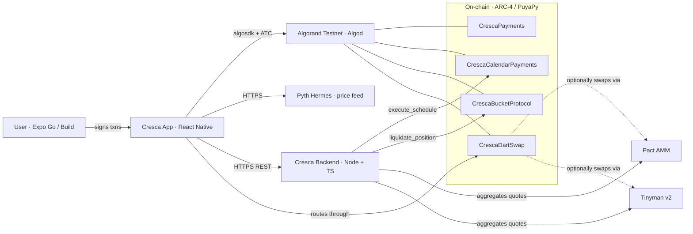
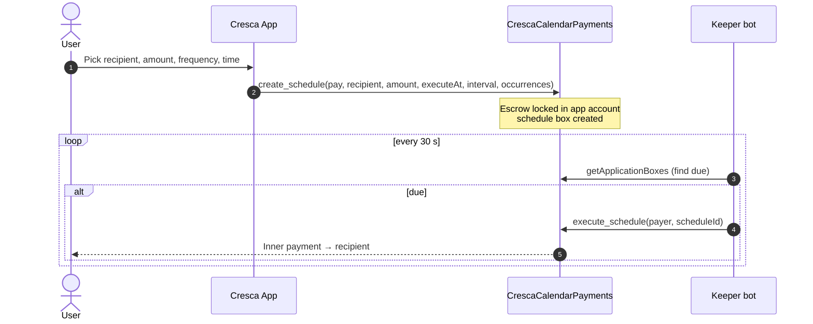
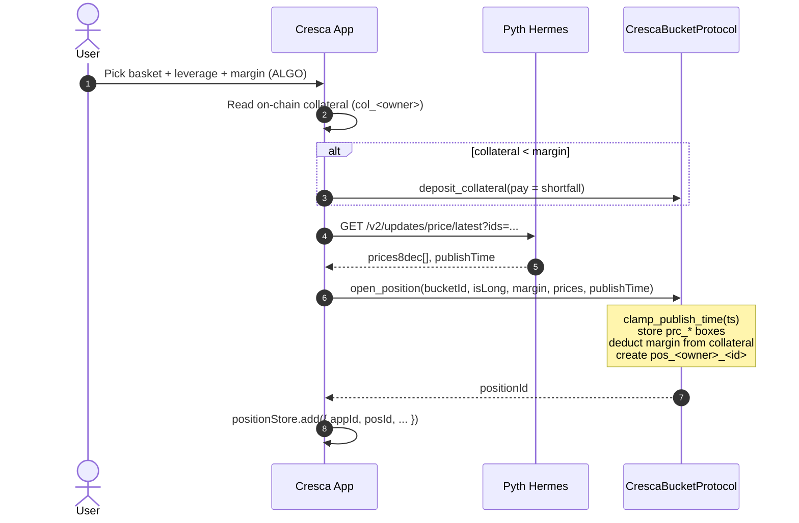

# Cresca

**A mobile-first Algorand wallet that bundles payments, scheduled transfers, leveraged basket trading and AMM swaps into one app.**

Cresca turns four common DeFi workflows into one-screen flows, backed by purpose-built ARC-4 smart contracts and the Pyth pull-oracle. The wallet runs on Expo + React Native; the contracts are written in Algorand Python (PuyaPy); a small Node/TS keeper bot drives time-based execution and liquidations.

---

## What Cresca solves

| Pain on Algorand today | Cresca's answer |
|---|---|
| Sending ALGO/ASA needs raw addresses & manual asset opt-in | Address book + automatic ASA opt-in flow inside Quick Pay |
| No native recurring or scheduled payments | `CrescaCalendarPayments` contract — escrow once, fires on schedule with a keeper |
| Going long/short on a basket of assets requires composing 5+ DeFi primitives | `CrescaBucketProtocol` — pick a basket, leverage 1×–150×, single-tx open/close |
| Best-price routing across DEXs requires manually checking each AMM | DART router quotes Pact, Tinyman and the in-house pool, executes against the best one |
| External wallets add friction for first-time users | Embedded hardware-backed signer (iOS Keychain / Android Keystore), Pera Wallet path available for power users |

---

## Live testnet deployment

All four contracts are deployed and wired into the app. **Source of truth: [`constants/config.ts`](constants/config.ts) and [`algorand-contracts/deployed_contracts.json`](algorand-contracts/deployed_contracts.json).**

| Contract | App ID | App Address |
|---|---:|---|
| `CrescaPayments` | **762822694** | `VJIYJ2OPTODP3AUDI6JMIFYJQLJKDC7LCSFWY4GL4MC47EXU44GE52SM44` |
| `CrescaCalendarPayments` | **762822695** | `7CANMYOKVD66AHSFWIJMIZR3W3D66D5XAJDGRE3NVXYMCVPTXILINN2WKM` |
| `CrescaBucketProtocol` | **762824138** | `PMIUSMNKWODYJ7DFMJYGYKZU32DLL7TSK6BDRKZ2U65EMBFU4YLKP47I4I` |
| `CrescaDartSwap` | **762822712** | `2S4HZ7EBHUDJRBR322NLQO5C2YTHBWJ6YH46XMTBW36FD3FMKPVT32TUDE` |

Explorer: `https://lora.algokit.io/testnet/application/<app-id>`

---

## Architecture



Three deployable units in one repo:

| Unit | Path | Stack | Job |
|---|---|---|---|
| Mobile wallet | `app/`, `services/`, `src/` | Expo SDK 54, RN 0.81, TS, expo-router | UI + direct contract calls |
| Smart contracts | `algorand-contracts/` | Algorand Python (PuyaPy), ARC-4 | On-chain state + business rules |
| Backend / keeper | `cresca-backend/` | Node 20, TS, algosdk, Supabase | Calendar execution, liquidations, DEX aggregation, push notifications |

---

## Features

### 1. Payments — `CrescaPayments`

- Quick Pay: send ALGO/ASA with QR scan or paste, auto opt-in to the destination ASA.
- Tap-to-Pay & batch send (up to 8 recipients, single atomic group).
- Contract surfaces volume + payment-count globals for analytics.

### 2. Scheduled & recurring payments — `CrescaCalendarPayments`

- User funds an escrow once; contract fires payments at `executeAt + n × intervalSeconds`.
- Keeper bot calls `execute_schedule` at the scheduled second — the user's phone can be offline.
- Cancel anytime; remaining escrow refunds in the same tx.



### 3. Leveraged basket trading — `CrescaBucketProtocol`

- Create a basket of up to 8 ASAs with weighted allocations summing to 100.
- Open long/short with 1×–150× leverage against deposited collateral.
- Pyth pull-oracle: prices are passed *into* the open/close call, not stored ahead of time — eliminates stale-oracle risk.
- Anyone (typically the keeper) can liquidate underwater positions.

### 4. DART swap router — `CrescaDartSwap`

- The on-chain constant-product pool for the in-house ALGO/TST pair.
- The DART router (`services/dartRouterService.ts`) quotes the on-chain pool and Pyth-derived oracle prices, picks the better route, executes through `swap_exact_algo_for_asset` / `swap_exact_asset_for_algo`.
- The backend version of the router (`cresca-backend/dist/lib/adapters/`) extends this with **Pact** (`@pactfi/pactsdk`) and **Tinyman v2** (`@tinymanorg/tinyman-js-sdk`) adapters for aggregator-style quoting.

---

## Algorand-native integrations

### Wallet signer

The mobile app uses an **embedded signer**: a 25-word mnemonic generated/imported during onboarding and stored in hardware-backed device storage via `expo-secure-store`:

- **iOS** → Keychain Services (Secure Enclave when available)
- **Android** → Android Keystore

This is the path used by every screen — `algorandService.getAccount()` is the singleton signer. **Pera Wallet** can be wired as an alternate external-signer path via `@perawallet/connect`; the wallet abstraction in `services/algorandService.ts` is signer-shaped so adding it doesn't ripple through the app.

### Oracle — Pyth pull model

`services/pythOracleService.ts` calls Pyth's Hermes HTTPS endpoint at trade time, encodes the price into the `open_position` / `close_position` call, and the contract clamps `publish_time` against the chain's `LatestTimestamp` so any small Hermes/chain drift never underflows. CoinGecko falls back when Pyth is unavailable.

### DEX aggregation

`cresca-backend` includes adapters for the major Algorand AMMs so the router can pick the best execution venue:

| AMM | Package | Used for |
|---|---|---|
| **Pact** | `@pactfi/pactsdk` | Quotes + execution on Pact pools |
| **Tinyman v2** | `@tinymanorg/tinyman-js-sdk` | Quotes + execution on Tinyman pools |
| **Folks Finance** | `@folks-finance/algorand-sdk` | Lending-side integrations (future) |
| **Cresca DartSwap** | in-house contract `762822712` | Native ALGO/TST pool |

The current mobile build routes through `CrescaDartSwap` for execution and uses Pyth for indicative quotes; the Pact/Tinyman adapters are the next slot in `dartRouterService.fetchQuote()`.

---

## Codebase layout

```text
wallet/
├── app/                          # Expo Router screens
│   ├── index.tsx                  # Home / Quick Pay
│   ├── payments.tsx               # P2P send
│   ├── calendar.tsx               # Scheduled payments
│   ├── bucket.tsx                 # Positions list + collateral
│   ├── bundleTrade.tsx            # Open long/short on a basket
│   ├── bundlesList.tsx            # Pre-built baskets
│   ├── swap.tsx                   # Swap UI + quote preview
│   ├── markets.tsx                # Live prices / charts
│   └── onboarding/                # Create / import wallet
├── services/                     # All on-chain + I/O logic
│   ├── algorandService.ts         # Signer, balance, opt-in, base txns
│   ├── algorandContractServices.ts # ARC-4 client for 4 Cresca contracts
│   ├── dartRouterService.ts       # Swap quote + execution + oracle ALGO-denom
│   ├── pythOracleService.ts       # Pyth Hermes client (8-dec prices)
│   ├── priceService.ts            # USD price cache w/ Pyth + CoinGecko fallback
│   ├── positionStore.ts           # Local index of open positions (app-id tagged)
│   ├── notificationService.ts     # Expo push + local notifications
│   ├── appPasswordService.ts      # Salted hash app lock
│   └── walletStorage.ts           # AsyncStorage cache (balances, history)
├── src/components/ui/            # Design-system primitives (Sheet, Input, Button…)
├── algorand-contracts/           # PuyaPy contracts + artifacts + deploy scripts
│   ├── cresca_payments.py
│   ├── cresca_calendar_payments.py
│   ├── cresca_bucket_protocol.py
│   ├── cresca_dart_swap.py
│   ├── deploy.py                  # Full deploy
│   ├── deploy_bucket_only.py      # Targeted re-deploy
│   ├── deploy_calendar_only.py    # Targeted re-deploy
│   └── artifacts/                 # Compiled TEAL + ARC-32 specs
├── cresca-backend/               # Keeper + REST API
│   ├── keeper/
│   │   ├── calendarKeeper.ts       # Polls due schedules → execute_schedule
│   │   └── liquidationKeeper.ts    # Polls underwater positions → liquidate_position
│   ├── api/                        # health, prices-history, waitlist, push-register
│   ├── lib/adapters/               # Tinyman + Pact + Folks SDK wrappers
│   └── shared/                     # config, supabase, contracts ABI strings
└── constants/                    # config (app IDs), theme, baskets
```

---

## Running the app

### Prereqs

- Node ≥ 20, npm
- Expo Go on iOS / Android *or* an Expo dev build
- For contract work: Python 3.11+ and `puyapy` (`pip install puyapy algokit-utils`)

### Mobile wallet

```bash
npm install
npm start               # then press i / a / w for iOS / Android / Web
# or
npm run android
npm run ios
```

If something looks stale after a code change, force a clean Metro bundle:

```bash
npx expo start --clear
```

Type-check / lint:

```bash
npx tsc --noEmit
npm run lint
```

### Keeper bot (optional, required for scheduled-payment auto-fire and liquidations)

```bash
cd cresca-backend
cp .env.example .env          # fill ALGO_KEEPER_MNEMONIC (25 words, funded ~5 ALGO)
npm install
npm run keeper:dev            # watches keeper/ for changes
# health endpoint:
curl http://localhost:3001
```

The keeper does **two** things and nothing else:

1. Every 30 s: scans `CrescaCalendarPayments` boxes, fires any schedule whose `executeAt + executed_count × interval <= now`.
2. Every 60 s: scans `CrescaBucketProtocol` positions, calls `liquidate_position` on anything under the 5 % margin threshold.

Normal trading and personal-payment flows don't need the keeper running.

### Smart contracts — compile & deploy

```bash
# Compile a single contract
cd algorand-contracts
puyapy cresca_bucket_protocol.py --out-dir artifacts --output-arc32

# Targeted re-deploy (preserves other 3 app IDs)
ALGO_DEPLOYER_MNEMONIC="word1 word2 ... word25" \
  python deploy_bucket_only.py
```

After deploying, update the four IDs in [`constants/config.ts`](constants/config.ts) **and** [`cresca-backend/shared/contracts.ts`](cresca-backend/shared/contracts.ts) **and** [`cresca-backend/tests/contracts.test.ts`](cresca-backend/tests/contracts.test.ts). `deploy_*_only.py` updates `deployed_contracts.json` automatically.

---

## End-to-end trade flow (annotated)



Two design decisions to highlight:

- **Box-ref sliding windows.** The client declares a small window of plausible `bkt_*` / `pos_*` box IDs around the counter it just read, so a one-round race between read and submit can't reject the transaction.
- **App-ID-tagged local state.** Every locally stored position carries the `appId` of the bucket contract it was opened on, so after a contract redeploy the old (now-orphan) positions disappear from the UI automatically.

---

## Security notes

- Mnemonics never leave the device — stored in OS keystore via `expo-secure-store`.
- App password is a salted SHA-256 hash, verified locally; protects the unlock screen.
- All contract calls use `AtomicTransactionComposer`; readonly methods (`get_*`, `is_*`) are routed through `simulate()` to avoid broadcasting (and to dodge duplicate-tx-in-ledger collisions).
- Pull-oracle prices are clamped to `Global.LatestTimestamp` inside the contract so Hermes timestamps that drift slightly into the future don't underflow.

---

## Troubleshooting

| Symptom | Fix |
|---|---|
| `invalid Box reference …` | Wrong app id in `constants/config.ts`, or a code change wasn't bundled — `npx expo start --clear` |
| `assert failed pc=… "Oracle price stale"` | Hermes/chain skew > 30 s — retry; if persistent, redeploy contract with current `_clamp_publish_time` helper |
| `transaction rejected by ApprovalProgram` on Delete | Contracts lack a delete handler — old test deploys are not reclaimable |
| `balance N below min M (X assets)` | Wallet hit min-balance reserve from ASA opt-ins / created apps — fund at [bank.testnet.algorand.network](https://bank.testnet.algorand.network/) |
| `transaction already in ledger` warning | Benign — same readonly call submitted twice; logged at `WARN` and ignored |

---

## Status

Algorand testnet only. Mainnet path: change network in `constants/config.ts` + re-deploy contracts to mainnet. The codebase is intentionally Algorand-first; legacy chains are out of scope.
